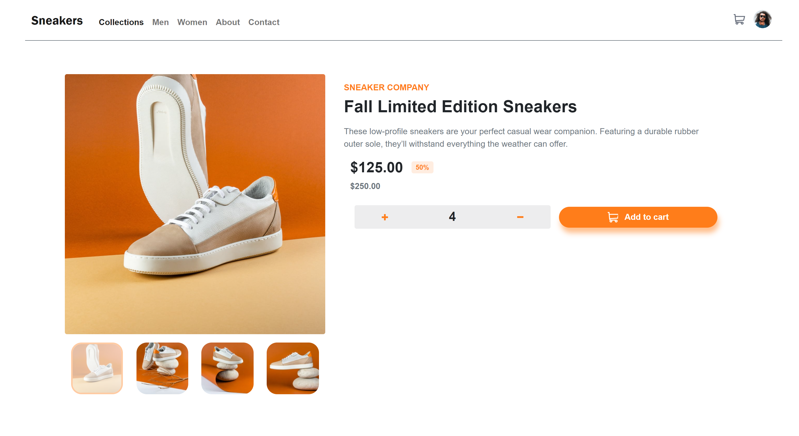

# E-commerce product page design from Frontend Mentor

Frontend Mentor challenges have helped me improve your coding skills by building realistic projects.

## Table of contents

- [Overview](#overview)
  - [The challenge](#the-challenge)
  - [Screenshot](#screenshot)
  - [Links](#links)
- [My process](#my-process)
  - [Built with](#built-with)
-[Developer](#developer) 

## Overview

### The challenge

Users should be able to:

- View the optimal layout for the site depending on their device's screen size
- See hover states for all interactive elements on the page
- Switch the large product image by clicking on the small thumbnail images
- Add items to the cart
- View the cart and remove items from it

### Screenshot

### Links

- Live Site URL: [E-Commerce Page](https://darq-envoy.github.io/e_commerce_webpage)

## My process

### Built with

- Semantic HTML5 markup
- CSS custom properties
- Flexbox
- Mobile-first workflow
- JavaScript
- BootStrap

## Developer
- Timothy - [Portfolio Website](https://www.darq-envoy.github.io)

